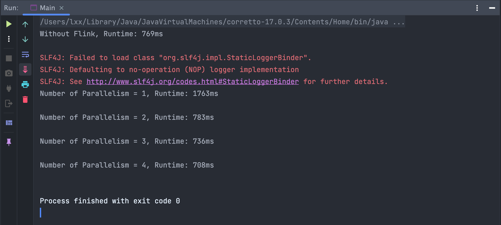

## Result of Changes

**update after using TupleX and Stream:**

---
##### Without Flink 
> Runtime: 769ms

##### With Flink

>- Number of Parallelism = 1, Runtime: 1763ms
>- Number of Parallelism = 2, Runtime: 783ms
>- Number of Parallelism = 3, Runtime: 736ms
>- Number of Parallelism = 4, Runtime: 708ms

---
---
